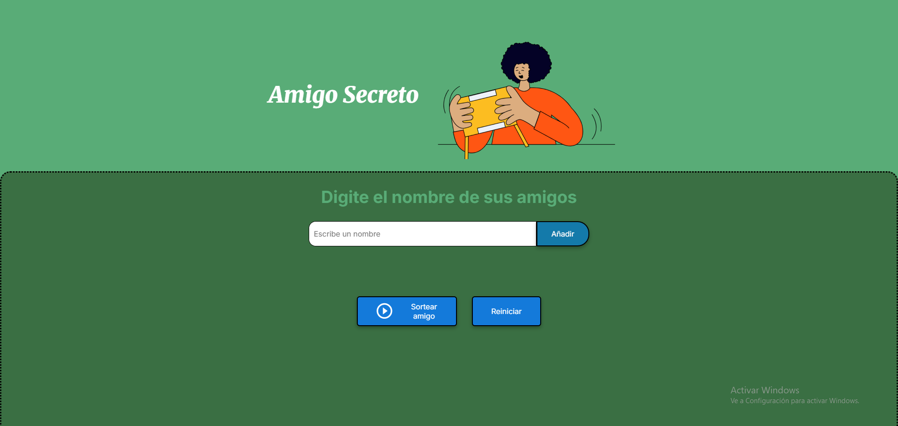

# challenge-amigo-secreto
Challenge de amigo secreto para la finalización del programa Formación Principiante en Programación - Alura Latam

# 💟 Amigo Secreto — Challenge Alura Latam

Este proyecto fue desarrollado como parte del Challenge de Alura Latam. Se trata de una aplicación web que permite agregar nombres de amigos y sortear aleatoriamente uno como “amigo secreto”. Está diseñado con una estética verde y celeste, animación de confetti al mostrar el ganador y una experiencia amigable para el usuario.

---

## 1️⃣ Funcionalidades

- ✅ Agregar nombres con validación (no se permiten campos vacíos ni números).
- ✅ Sortear un amigo secreto con animación y confetti 🎉.
- ✅ Botón para reiniciar la lista y comenzar una nueva ronda.
- ✅ Agregar nombres presionando Enter.

---

## 2️⃣ Aprendizajes y aciertos

Durante el desarrollo del proyecto, logré:

- Comprender mejor la manipulación del DOM con JavaScript.
- Aplicar validaciones personalizadas para mejorar la experiencia del usuario.
- Integrar una librería externa (Canvas Confetti) para animaciones.
- Usar `addEventListener` para capturar la tecla Enter.
- Organizar el código en funciones claras y reutilizables.
- Personalizar el diseño con CSS colores pasteles y animaciones suaves.

---

## 3️⃣ Dificultades superadas

- Al principio, el botón “Agregar amigo” no funcionaba porque el `id` del input no coincidía con el JavaScript. Aprendí a revisar la consola y depurar errores.
- El confetti no se mostraba porque el script no estaba bien enlazado. Lo solucioné entendiendo el orden de carga de los scripts.
- Los botones aparecían uno debajo del otro. Aprendí a usar `display: flex` y `gap` para alinearlos horizontalmente.
- Nunca había hecho un `README.md`, pero ahora sé cómo estructurarlo y qué incluir.

---

## 4️⃣ Tecnologías usadas

- HTML  
- CSS  
- JavaScript  
- [Canvas Confetti](https://www.kirilv.com/canvas-confetti/) para la animación

---

## 5️⃣ Cómo usar

1. Clona el repositorio  
2. Abre `index.html` en tu navegador  
3. Agrega nombres y haz clic en “Sortear amigo”  
4. Usa el botón “Reiniciar” para comenzar una nueva ronda

---

## 👀 Vista previa

---

## 💟 Autora

Desarrollado por Leticia R. Machuca como parte del Challenge de Alura Latam.  
Apasionada por seguir aprendiendo sobre el desarrollo web.

